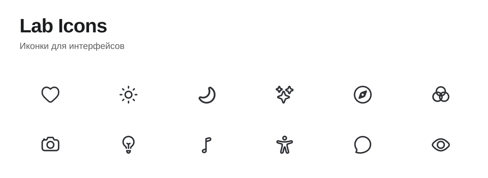

# Lab Icons



[Начать](#начало-работы) · [Коллекция SVG](svg/Outline) · [Документация](docs/README.md)

Иконки Labpics для интерфейсов: контурные и залитые SVG, от навигации до маленьких деталей.
Цвет задаёт ваш интерфейс — статические иконки наследуют `currentColor`.

Посмотрите [контурную](svg/Outline) и [залитую](svg/Filled) коллекции или подключите пакет.

## Начало работы

[Установка, требования к среде и точки входа](docs/package.md) формируются из
контракта поставки. Основной канал — публичный npm; наличие версии в checkout
не является подтверждением её публикации.

После установки пакет предоставляет именованные SVG-строки:

```js
import { accessibilityOutline } from '@labpics/icons';

console.log(accessibilityOutline);
```

Геометрическую модель и доступные оси запрашивают отдельно:

```js
import { glyph, glyphCapabilities } from '@labpics/icons/ir';

const source = glyph({
  icon: 'accessibility',
  variant: 'outline',
  modelMode: 'source-only',
});
const capabilities = glyphCapabilities('reload', 'outline');
console.log(source, capabilities);
```

Перед использованием оси проверяйте возможности конкретного варианта.
Режим `source-only` возвращает авторскую геометрию без придуманной
декомпозиции; исследовательские модели не включаются неявно.

## Работа с исходниками

```sh
pnpm install --frozen-lockfile
pnpm verify
```

`pnpm verify` включает сборку. Для геометрического сравнения выполните
`pnpm observatory` и откройте созданную локальную страницу. Диагностический
отчёт не заменяет визуальное ревью и не переводит модель в принятое состояние.

[Документация](docs/README.md) разделяет рабочие процедуры, точную справку и
объяснения. Добавление иконки описано в [процедуре приёма](docs/agent-workflow.md),
сборка и релиз — в [отдельной процедуре](docs/build-release.md), пределы
параметрических возможностей — в [справке](docs/capabilities.md).

## Лицензия

[MIT](LICENSE).
